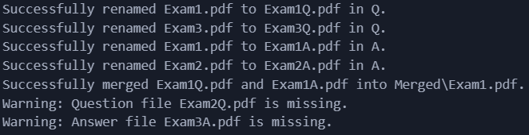

# 
# PDF Exam Q&A Merger

## Introduction

The PDF Exam Q&A Merger is a Python utility designed to automate the process of renaming and merging PDF files for educational purposes. It is particularly useful for students and educators who need to compile question and answer sets from past exams into organized, single-document PDFs.

## Features

- **Automatic File Renaming**: Automatically renames PDF files in the designated `Q` (questions) and `A` (answers) folders by appending suffixes for easy identification.
- **Efficient PDF Merging**: Merges corresponding question and answer PDFs into a single document, simplifying study and review processes.
- **Comprehensive Error Handling**: Provides console notifications and logs detailed information about successful operations and any errors encountered, such as missing files.
- **Detailed Logging**: Tracks all operations in a log file (`file_operations.log`) for audit and troubleshooting purposes.

## Usage

1. **Prepare Files**: Place your question PDF files in the `Q` folder and answer PDF files in the `A` folder. Ensure that the filenames are identical, differing only in the suffix.

2. **Directory Structure**:
   Ensure your project directory is set up as follows:

   Make sure to place the .py file in the same directory as the Q and A folders
   

4. **Run the Script**: Execute the script to automatically rename and merge your PDFs.

5. **Review Merged Files**: Access the merged PDFs in the `Merged` folder.

## Error Handling and Logs

The PDF Exam Q&A Merger incorporates robust error handling to ensure smooth operation.
If a question or answer PDF file is missing, the system will log a warning message and display a notification to the user, specifying which file is missing.
All operations, successful or otherwise, are logged and promted in a detailed manner for audit and troubleshooting purposes.

**Logging Details:**
- Logs are written to `file_operations.log`, which includes timestamps, error levels, and descriptive messages about each operation.
- Errors related to file renaming or merging are clearly detailed to aid in resolving issues quickly.

This proactive approach to error management and logging ensures that any issues can be diagnosed and corrected efficiently, enhancing the reliability and usability of the tool.

## Requirements

- **Python**: Version 3.x is required.
- **Dependencies**:
  - **PyPDF2**: For PDF manipulation.
  - Install using: 
    \`\`\`bash
    pip install PyPDF2
    \`\`\`

## How to Use

1. **Clone the Repository**:
   - Use the command \`git clone https://github.com/Tapuz97/pdf-merger.git\` to clone the repository to your local machine.

2. **Install Dependencies**:
   - Navigate to the project directory and run:
     \`\`\`bash
     pip install -r requirements.txt
     \`\`\`
     This will install necessary packages.

3. **Prepare the Directory Structure**:
   - Ensure your project directory follows the structure described above.

4. **Execute the Script**:
   - Run the script using Python:
     \`\`\`bash
     python pdf_merger.py
     \`\`\`
   - Follow console instructions and messages to ensure all files are processed correctly.

## Local Development

To set up the project for local development:

1. **Clone the Repository**:
   - \`git clone https://github.com/Tapuz97/pdf-merger.git\`

2. **Set Up Your Environment**:
   - Ensure Python 3.x is installed.
   - Install dependencies with:
     \`\`\`bash
     pip install -r requirements.txt
     \`\`\`

3. **Run the Script**:
   - Execute:
     \`\`\`bash
     python pdf_merger.py
     \`\`\`
   - Start merging your PDFs.

## Contribution

Contributions to the PDF Exam Q&A Merger are welcome. To contribute:

1. **Fork the Repository**.
2. **Create a Branch** for your feature:
   \`\`\`bash
   git checkout -b feature/amazing-feature
   \`\`\`
3. **Commit Your Changes**:
   \`\`\`bash
   git commit -m 'Add some amazing feature'
   \`\`\`
4. **Push to the Branch**:
   \`\`\`bash
   git push origin feature/amazing-feature
   \`\`\`
5. **Open a Pull Request**.

## License

This project is licensed under the MIT License - see the [LICENSE.md](LICENSE) file for details.

## Acknowledgments

- Special thanks to all contributors who have helped improve this tool.
- Appreciation for the open-source community, which provides the foundational technologies used in this application.

---

Thank you for considering the PDF Exam Q&A Merger for your document processing needs. This README provides a general overview of the project. For additional details, please refer to the source code and inline documentation.
